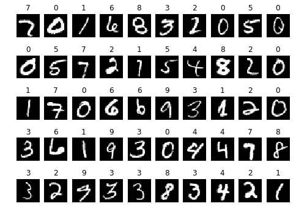
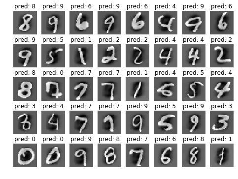

# Handwritten Digit Recognition with Pure Numpy Coded Neural Network and Residual Block on MNIST Dataset

The *Handwritten Digit Recognition.ipynb* maintains the structure of the project.

## Introduction

Handwritten digit recognition is a good first-lesson on image recognition for beginners.
   
The MNIST dataset consists 60000 training examples and 10000 test examples, of digits 0-9, can be downloaded from [Yann Lecun's website](http://yann.lecun.com/exdb/mnist/).
   
In this project we will:

- Implement a 2-layer neural network.
- Compute the forward pass and backward pass with svm loss.
- Use the normlizaiton to help network converge.
- Use a stochastic gradient descent to optimize the loss function.
- Try a new type of neural network: Resnet, and apply the methodology to a three layer neural network.

## Examples

Here are some digit examples from training set:

Here is the performance of our model on test set:

The test set accuracy is about 98.2%.

## LICENSE:

MIT

